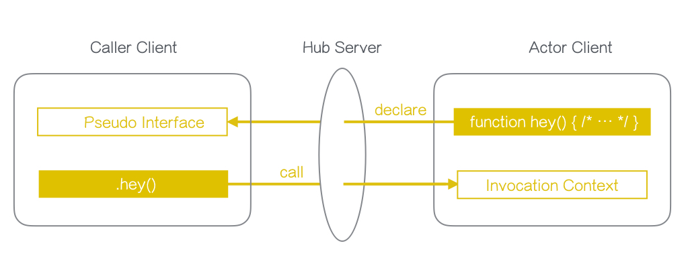

 


<!---
This file is generated by ape-tmpl. Do not update manually.
--->

<!-- Badge Start -->
<a name="badges"></a>

[![Build Status][bd_travis_shield_url]][bd_travis_url]
[![npm Version][bd_npm_shield_url]][bd_npm_url]
[![JS Standard][bd_standard_shield_url]][bd_standard_url]

[bd_repo_url]: https://github.com/realglobe-Inc/sugos
[bd_travis_url]: http://travis-ci.org/realglobe-Inc/sugos
[bd_travis_shield_url]: http://img.shields.io/travis/realglobe-Inc/sugos.svg?style=flat
[bd_travis_com_url]: http://travis-ci.com/realglobe-Inc/sugos
[bd_travis_com_shield_url]: https://api.travis-ci.com/realglobe-Inc/sugos.svg?token=
[bd_license_url]: https://github.com/realglobe-Inc/sugos/blob/master/LICENSE
[bd_codeclimate_url]: http://codeclimate.com/github/realglobe-Inc/sugos
[bd_codeclimate_shield_url]: http://img.shields.io/codeclimate/github/realglobe-Inc/sugos.svg?style=flat
[bd_codeclimate_coverage_shield_url]: http://img.shields.io/codeclimate/coverage/github/realglobe-Inc/sugos.svg?style=flat
[bd_gemnasium_url]: https://gemnasium.com/realglobe-Inc/sugos
[bd_gemnasium_shield_url]: https://gemnasium.com/realglobe-Inc/sugos.svg
[bd_npm_url]: http://www.npmjs.org/package/sugos
[bd_npm_shield_url]: http://img.shields.io/npm/v/sugos.svg?style=flat
[bd_standard_url]: http://standardjs.com/
[bd_standard_shield_url]: https://img.shields.io/badge/code%20style-standard-brightgreen.svg

<!-- Badge End -->


<!-- Description Start -->
<a name="description"></a>

A high-level RPC framework to make remote controlling super easy.

<!-- Description End -->


<!-- Overview Start -->
<a name="overview"></a>

What you can do with SUGOS is:

1. Declare a function on a client.
2. Call the function from another client.

SUGOS magically connect two clients on remote networks, and provides pseudo function interface as if they are on the same environment.




It also supports event driven architecture. You can emit or listen remote events in [Node.js events](https://nodejs.org/api/events.html#events_events) style.
This feature greatly helps you to build applications for IoT or Cloud Robotics.


<!-- Overview End -->


<!-- Sections Start -->
<a name="sections"></a>

<!-- Section from "doc/guides/00.TOC.md.hbs" Start -->

<a name="section-doc-guides-00-t-o-c-md"></a>

Table of Contents
----------------

- [Requirements](#requirements)
- [Installation](#installation)
- [Getting Started](#getting-started)
  * [Setup SUGO-Hub](#setup-sugo-hub)
  * [Declare modules on SUGO-Actor](#declare-modules-on-sugo-actor)
  * [Access to modules from SUGO-Caller](#access-to-modules-from-sugo-caller)
- [Advanced Usage](#advanced-usage)
  * [Using Event-Emit Interface](#using-event-emit-interface)
- [Tutorials](#tutorials)
- [API Docs](#api-docs)
- [Related Packages](#related-packages)
- [Contributors](#contributors)
- [License](#license)
- [Links](#links)


<!-- Section from "doc/guides/00.TOC.md.hbs" End -->

<!-- Section from "doc/guides/10.Requirements.md.hbs" Start -->

<a name="section-doc-guides-10-requirements-md"></a>

Requirements
-----

<a href="https://nodejs.org">
  </a>
<a href="https://docs.npmjs.com/">
  </a>

+ [Node.js ( >=6 )][node_download_url]
+ [npm ( >=4 )][npm_url]

[node_download_url]: https://nodejs.org/en/download/
[npm_url]: https://docs.npmjs.com/


<!-- Section from "doc/guides/10.Requirements.md.hbs" End -->

<!-- Section from "doc/guides/20.Getting Started.md.hbs" Start -->

<a name="section-doc-guides-20-getting-started-md"></a>

Getting Started
---------

3 steps to be getting started

1. [Setup SUGO-Hub](#setup-sugo-hub)
2. [Declare modules on SUGO-Actor](#declare-on-sugo-actor)
3. [Access to modules from SUGO-Caller](#call-from-sugo-caller)

<a id="setup-sugo-hub"></a>
### Setup SUGO-Hub

<a href="https://github.com/realglobe-Inc/sugo-hub"></a>

Setup a [SUGO-Hub][sugo_hub_url] server for actors and callers.

```javascript
#!/usr/bin/env node
/**
 * This is an example of SUGO-Hub
 * @see https://github.com/realglobe-Inc/sugo-hub
 */
'use strict'

const sugoHub = require('sugo-hub')

;(async () => {
  // Start sugo-hub server
  let hub = await sugoHub({}).listen(3000)
  console.log(`SUGO Hub started at port: ${hub.port}`)
}).catch((err) => console.error(err))

```

<a id="declare-on-sugo-actor"></a>
### Declare modules on SUGO-Actor

<a href="https://github.com/realglobe-Inc/sugo-actor"></a>

Create a [SUGO-Actor][sugo_actor_url] instance and declare modules. Then, connect to the hub server.

```javascript
#!/usr/bin/env

/**
 * This is an example of SUGO-Actor
 * @see https://github.com/realglobe-Inc/sugo-actor
 */
'use strict'

const sugoActor = require('sugo-actor')
const { Module } = sugoActor

;(async () => {
  let actor = sugoActor({
    /** Host of hub to connect */
    hostname: 'localhost',
    port: 3000,
    /** Name to identify this actor on the hub */
    key: 'my-actor-01',
    /** Modules to provide */
    modules: {
      // Example of a simple call-return function module
      tableTennis: new Module({
        async ping (pong = 'default pong!') {
          /* ... */
          return `"${pong}" from actor!` // Return to the remote caller
        }
      }),
      // Load plugin module
      timeBomb: require('./example-time-bomb-module')({})
    }
  })
  await actor.connect() // Connect to the hub server
}).catch((err) => console.error(err))

```


<a id="call-from-sugo-caller"></a>
### Access to modules from SUGO-Caller

<a href="https://github.com/realglobe-Inc/sugo-caller"></a>

Create a [SUGO-Caller][sugo_caller_url] instance and connect to the actor with key.
Then get access to modules and call functions as you like.

```javascript
#!/usr/bin/env

/**
 * This is an example of SUGO-Caller
 * @see https://github.com/realglobe-Inc/sugo-caller
 */
'use strict'

const sugoCaller = require('sugo-caller')
;(async () => {
  let caller = sugoCaller({
    // Host of hub to connect
    hostname: 'localhost',
    port: 3000
  })
  // Connect to an actor with key
  let actor01 = await caller.connect('my-actor-01')

  // Using call-return function
  {
    let tableTennis = actor01.get('tableTennis')
    let pong = await tableTennis.ping('hey!')
    console.log(pong) // -> `"hey!" from actor!`
  }

}).catch((err) => console.error(err))

```


<!-- Section from "doc/guides/20.Getting Started.md.hbs" End -->

<!-- Section from "doc/guides/21.Advanced Usage.md.hbs" Start -->

<a name="section-doc-guides-21-advanced-usage-md"></a>

Advanced Usage
---------

### Using Event-Emit Interface

On actors, each module provides [EventEmitter][event_emitter_url] interface like `.on(ev, handler)` and `.emit(ev, data)` functions.

```javascript
/**
 * This is an example module
 */
'use strict'

const { Module } = require('sugo-actor')

class TimeBomb extends Module {
  // Example of event emitting function
  async countDown (count) {
    const s = this
    let abort = () => { count = -1 }
    s.on('abort', abort) // Listen to events from the caller
    while (count > 0) {
      count--
      s.emit('tick', { count }) // Emit an event to the caller
      await new Promise((resolve) =>
        setTimeout(() => resolve(), 1000)
      )
    }
    s.off('abort', abort) // Remove event listener
    return count === -1 ? 'hiss...' : 'booom!!!'
  }
}

function newTimeBomb (...args) {
  return new TimeBomb(...args)
}

module.exports = newTimeBomb // Pass factory method

```

```javascript
#!/usr/bin/env

/**
 * This is an example of SUGO-Caller to use event emit
 */
'use strict'

const sugoCaller = require('sugo-caller')

;(async () => {
  let caller = sugoCaller({ /* ... */ })
  let actor01 = await caller.connect('my-actor-01')

  // Using event emitting interface
  {
    let timeBomb = actor01.get('timeBomb')
    let tick = (data) => console.log(`tick: ${data.count}`)
    timeBomb.on('tick', tick) // Add listener
    let booom = await timeBomb.countDown(10)
    console.log(booom)
    timeBomb.off('tick', tick) // Remove listener
  }
}).catch((err) => console.error(err))

```

[event_emitter_url]: https://nodejs.org/api/events.html#events_class_eventemitter


<!-- Section from "doc/guides/21.Advanced Usage.md.hbs" End -->

<!-- Section from "doc/guides/22.Tutorials.md.hbs" Start -->

<a name="section-doc-guides-22-tutorials-md"></a>

Tutorials
----------

- [Official Tutorial](https://github.com/realglobe-Inc/sugos-tutorial)
    - [00 - Let us begin with SUGOS](https://github.com/realglobe-Inc/sugos-tutorial/blob/master/dist/markdown/en/00%20-%20Let%20us%20begin%20with%20SUGOS.md)
    - [01 - Hello World, as always](https://github.com/realglobe-Inc/sugos-tutorial/blob/master/dist/markdown/en/01%20-%20Hello%20World%2C%20as%20always.md)
    - [02 - Using Event Emit](https://github.com/realglobe-Inc/sugos-tutorial/blob/master/dist/markdown/en/02%20-%20Using%20Event%20Emit.md)
    - [03 - Communication betweein Browsers](https://github.com/realglobe-Inc/sugos-tutorial/blob/master/dist/markdown/en/03%20-%20Communication%20betweein%20Browsers.md)
    - [04 - Module as npm package](https://github.com/realglobe-Inc/sugos-tutorial/blob/master/dist/markdown/en/04%20-%20Module%20as%20npm%20package.md)


<!-- Section from "doc/guides/22.Tutorials.md.hbs" End -->

<!-- Section from "doc/guides/23.API.md.hbs" Start -->

<a name="section-doc-guides-23-a-p-i-md"></a>

API Docs
---------

+ [SUGO-Hub](./doc/api/hub.md)
+ [SUGO-Actor](./doc/api/actor.md)
+ [SUGO-Caller](./doc/api/caller.md)


<!-- Section from "doc/guides/23.API.md.hbs" End -->

<!-- Section from "doc/guides/30.Related packages.md.hbs" Start -->

<a name="section-doc-guides-30-related-packages-md"></a>

Related Packages
---------

There are a bunch of related package and there are listed in [sugos-index page][sugos_index_url]

+ [Core packages](https://github.com/realglobe-Inc/sugos-index#package-group-Core) - Core of SUGOS
+ [Demo packages](https://github.com/realglobe-Inc/sugos-index#package-group-Demo) - Demo for SUGOS scaffolding
+ [Example packages](https://github.com/realglobe-Inc/sugos-index#package-group-Example) - Example project using SUGOS framework
+ [Module packages](https://github.com/realglobe-Inc/sugos-index#package-group-Module) - Module plugins for SUGOS-Actor
+ [Middleware packages](https://github.com/realglobe-Inc/sugos-index#package-group-Middleware) - Middleware plugins for SUGO-Cloud
+ [Endpoint packages](https://github.com/realglobe-Inc/sugos-index#package-group-Endpoint) - Endpoint plugins for SUGO-Cloud
+ [Agent packages](https://github.com/realglobe-Inc/sugos-index#package-group-Agent) - Agent of endpoints
+ [Helper packages](https://github.com/realglobe-Inc/sugos-index#package-group-Helper) - Helper packages.


[sugos_index_url]: https://github.com/realglobe-Inc/sugos-index#readme


<!-- Section from "doc/guides/30.Related packages.md.hbs" End -->

<!-- Section from "doc/guides/40.Contributors.md.hbs" Start -->

<a name="section-doc-guides-40-contributors-md"></a>

Contributors
------------

+ [Taka Okunishi](https://github.com/okunishinishi)
+ [Fukuchi Daisuke](https://github.com/fukuchidaisuke)
+ [Fuji Haruka](https://github.com/FujiHaruka)


<!-- Section from "doc/guides/40.Contributors.md.hbs" End -->


<!-- Sections Start -->


<!-- LICENSE Start -->
<a name="license"></a>

License
-------
This software is released under the [Apache-2.0 License](https://github.com/realglobe-Inc/sugos/blob/master/LICENSE).

<!-- LICENSE End -->


<!-- Links Start -->
<a name="links"></a>

Links
------

+ [sugo-hub][sugo_hub_url]
+ [sugo-actor][sugo_actor_url]
+ [sugo-caller][sugo_caller_url]
+ [sugos-index][sugos_index_url]
+ [sugos.tech][sugos_tech_url]

[sugo_hub_url]: https://github.com/realglobe-Inc/sugo-hub
[sugo_actor_url]: https://github.com/realglobe-Inc/sugo-actor
[sugo_caller_url]: https://github.com/realglobe-Inc/sugo-caller
[sugos_index_url]: https://github.com/realglobe-Inc/sugos-index#readme
[sugos_tech_url]: http://www.sugos.tech

<!-- Links End -->
