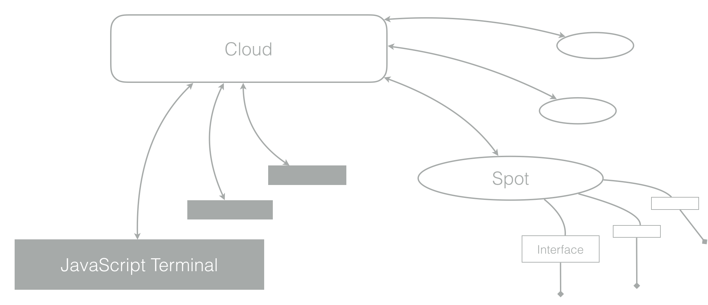

sugos
==========

<!---
This file is generated by ape-tmpl. Do not update manually.
--->

<!-- Badge Start -->
<a name="badges"></a>

[![Build Status][bd_travis_com_shield_url]][bd_travis_com_url]
[![npm Version][bd_npm_shield_url]][bd_npm_url]
[![JS Standard][bd_standard_shield_url]][bd_standard_url]

[bd_repo_url]: https://github.com/realglobe-Inc/sugos
[bd_travis_url]: http://travis-ci.org/realglobe-Inc/sugos
[bd_travis_shield_url]: http://img.shields.io/travis/realglobe-Inc/sugos.svg?style=flat
[bd_travis_com_url]: http://travis-ci.com/realglobe-Inc/sugos
[bd_travis_com_shield_url]: https://api.travis-ci.com/realglobe-Inc/sugos.svg?token=
[bd_license_url]: https://github.com/realglobe-Inc/sugos/blob/master/LICENSE
[bd_codeclimate_url]: http://codeclimate.com/github/realglobe-Inc/sugos
[bd_codeclimate_shield_url]: http://img.shields.io/codeclimate/github/realglobe-Inc/sugos.svg?style=flat
[bd_codeclimate_coverage_shield_url]: http://img.shields.io/codeclimate/coverage/github/realglobe-Inc/sugos.svg?style=flat
[bd_gemnasium_url]: https://gemnasium.com/realglobe-Inc/sugos
[bd_gemnasium_shield_url]: https://gemnasium.com/realglobe-Inc/sugos.svg
[bd_npm_url]: http://www.npmjs.org/package/sugos
[bd_npm_shield_url]: http://img.shields.io/npm/v/sugos.svg?style=flat
[bd_standard_url]: http://standardjs.com/
[bd_standard_shield_url]: https://img.shields.io/badge/code%20style-standard-brightgreen.svg

<!-- Badge End -->


<!-- Description Start -->
<a name="description"></a>

Super Ultra Gorgeous Outstanding Special framework for WoT

<!-- Description End -->


<!-- Overview Start -->
<a name="overview"></a>


SUGOS enable you to control machines from remote network with Javascript.  

```javascript
#!/usr/bin/env node

/**
 * This is an example to connect remote machines
 */
'use strict'

const co = require('co')
const sugoTerminal = require('sugo-terminal')

const CLOUD_URL = 'my-sugo-cloud.example.com'

co(function * () {
  // Create a terminal instances
  let terminal = sugoTerminal(CLOUD_URL, {})

  // Connect to spot in remote network
  let mac = yield terminal.connect('my-mac-book-01')
  let windows = yield terminal.connect('my-windows-pc-01')

  // Access to interface of spots
  let shell = mac.shell()
  let kinect = windows.kinect()

  // Subscribe event
  kinect.on('bodyFrame', co.wrap(function * handleBodyFrame (bodyFrame) {
    let { leftHand, head } = windows.kinect.helpers.parse(bodyFrame)
    if (leftHand.cameraY > head.cameraY) {
      // Send command and Wait for results
      let result = yield shell.exec('say', [ 'Left hands up!' ])
      /* ... */
    }
  }))

  kinect.start() // Asynchronous operation
}).catch((err) => console.error(err))

```


<!-- Overview End -->


<!-- Sections Start -->
<a name="sections"></a>

<!-- Section from "doc/guides/00.Mechanisms.md.hbs" Start -->

<a name="section-doc-guides-00-mechanisms-md"></a>
Mechanism
-----

**Sugo-Cloud** server works as hub and interchange events between
**Sugo-Spots** and **Sugo-Terminal**





<!-- Section from "doc/guides/00.Mechanisms.md.hbs" End -->

<!-- Section from "doc/guides/01.Installation.md.hbs" Start -->

<a name="section-doc-guides-01-installation-md"></a>
Installation
-----

```bash
$ npm install sugos --save
```


<!-- Section from "doc/guides/01.Installation.md.hbs" End -->

<!-- Section from "doc/guides/02.Usage.md.hbs" Start -->

<a name="section-doc-guides-02-usage-md"></a>
Usage
---------

#### Running Cloud Server

```javascript
#!/usr/bin/env node

/**
 * This is an example to setup cloud server
 */

'use strict'

const sugoCloud = require('sugo-cloud')

const co = require('co')

co(function * () {
  // Start sugo-cloud server
  let cloud = yield sugoCloud({
    // Options
    port: 3000
  })

  console.log(`SUGO Cloud started at port: ${cloud}`)

  return cloud
}).catch((err) => { /* ... */ })

```

For more detail, see [sugo-cloud](https://github.com/realglobe-Inc/sugo-cloud)

#### Running Spot Client

```javascript
#!/usr/bin/env node

/**
 * This is an example to run local spot server
 */

'use strict'

const sugoSpot = require('sugo-spot')
const co = require('co')

const CLOUD_URL = 'http://my-sugo-cloud.example.com/spots'

co(function * () {
  let spot = sugoSpot(CLOUD_URL, {
    key: 'my-spot-01',
    interfaces: {
      // Add plugin to provide shell interface
      shell: require('sugo-spot-shell')({})
    }
  })

// Connect to cloud server
  yield spot.connect()
}).catch((err) => console.error(err))

```

For more detail, see [sugo-spot](https://github.com/realglobe-Inc/sugo-spot)


#### Remote Terminal Client

```javascript
#!/usr/bin/env node

/**
 * This is an example to use terminal to connect remote spot
 */
'use strict'

const co = require('co')
const sugoTerminal = require('sugo-terminal')

const CLOUD_URL = 'my-sugo-cloud.example.com'
const TARGET_SPOT_ID = 'my-spot-01'

co(function * () {
  let terminal = sugoTerminal(CLOUD_URL, {})

// Connect to the target spot
  let spot = yield terminal.connect(TARGET_SPOT_ID)
  let shell = spot.shell() // Get bash interface

  // Trigger ls command on remote spot
  {
    let lsResult = yield shell.exec('ls -la /opt/shared')
    console.log(lsResult)
  }

  // Pipe std out
  {
    let out = (chunk) => process.stdout.write(chunk)
    shell.on('stdout', out)
    shell.spawn('tail -f /var/log/app.log') // Trigger tailing without blocking
    yield new Promise((resolve) => setTimeout(() => resolve(), 3000)) // Block for duration
    shell.off('stdout', out)
  }

  // Run reboot command
  yield shell.exec('reboot')
}).catch((err) => console.error(err))


```

For more detail, see [sugo-terminal](https://github.com/realglobe-Inc/sugo-terminal)


<!-- Section from "doc/guides/02.Usage.md.hbs" End -->


<!-- Sections Start -->


<!-- LICENSE Start -->
<a name="license"></a>

License
-------
This software is released under the [MIT License](https://github.com/realglobe-Inc/sugos/blob/master/LICENSE).

<!-- LICENSE End -->


<!-- Links Start -->
<a name="links"></a>

Links
------

+ [sugo-spot](https://github.com/realglobe-Inc/sugo-spot)
+ [sugo-cloud](https://github.com/realglobe-Inc/sugo-cloud)
+ [sugo-client](https://github.com/realglobe-Inc/sugo-client)

<!-- Links End -->
